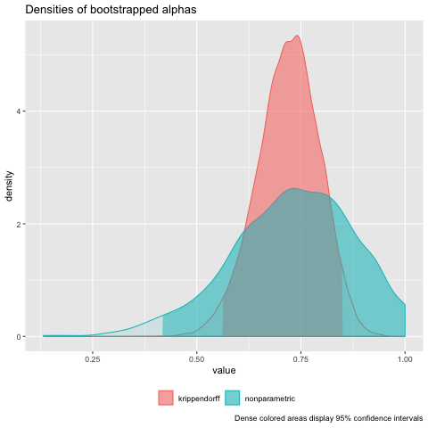

# icr

*icr* provides functions to compute and plot Krippendorff's inter-coder
reliability coefficient \(\alpha\) and bootstrapped uncertainty
estimates. The bootstrap routines are set up to make use of parallel
threads via [OpenMP](https://en.wikipedia.org/wiki/OpenMP).

## Installation

``` r
# Install the released version from CRAN:
install.packages("icr")

# Or install the development version from GitHub:
# install.packages("devtools")
devtools::install_github("staudtlex/icr")
```

## Enable parallel bootstraps on macOS

The parallel bootstrap capability of *icr* depends on compiler support
for OpenMP, which the Clang compiler shipped by default with macOS does
not support. To circumvent this issue, install the GNU Compiler
Collection (GCC), for instance via [Homebrew](https://brew.sh/).

``` bash
brew install gcc
```

R needs to know the location of the new compiler. Therefore, modify your
*Makevars* file under \~/.R; if .R does not exist on your system, you
may need to create that directory first. Add the following lines to
*Makevars* and save it (note that all future R packages you will install
from source and requiring compilation will be built with GCC.).

``` bash
CC = /usr/local/bin/gcc-8
CXX = /usr/local/bin/g++-8
CXX11 = /usr/local/bin/g++-8
```

Now, install icr from source.

``` r
# From CRAN
install.packages("icr", type = "source")

# Latest version from GitHub
devtools::install_github("staudtlex/icr")
```

## Usage

Load the library and Krippendorff's example data:

``` r
library(icr)
data(codings)

codings
```

``` example
     [,1] [,2] [,3] [,4] [,5] [,6] [,7] [,8] [,9] [,10] [,11] [,12]
[1,]    1    2    3    3    2    1    4    1    2    NA    NA    NA
[2,]    1    2    3    3    2    2    4    1    2     5    NA    NA
[3,]   NA    3    3    3    2    3    4    2    2     5     1     3
[4,]    1    2    3    3    2    4    4    1    2     5     1    NA
```

Compute the reliability coefficient \(\alpha\) for nominal-level data.

``` r
krippalpha(codings, metric = "nominal")
```

``` example

Krippendorff's alpha 

Alpha coders units   level
0.743      4    12 nominal

Bootstrapped alpha
Alpha Std. Error 2.5 % 97.5 % Boot. technique Bootstraps
   NA         NA    NA     NA    Krippendorff         NA
   NA         NA    NA     NA   nonparametric         NA

P(alpha > alpha_min):
alpha_min krippendorff nonparametric
     0.90           NA            NA
     0.80           NA            NA
     0.70           NA            NA
     0.67           NA            NA
     0.60           NA            NA
     0.50           NA            NA
```

To check how uncertain \(\alpha\) may be, or whether it actually differs
from various minimal reliability thresholds, bootstrap \(\alpha\). For
reproducibility, do not forget to set the seed (defaults to `seed =
c(12345, 12345, 12345, 12345, 12345, 12345)`).

Given that bootstrapping may take quite some time for large amounts of
reliability data, increase the number of cores across which `krippalpha`
may distribute the computations (note that if your version does not
support the use of multiple cores, `krippalpha` will reset `cores` to
1).

``` r
alpha <- krippalpha(codings, metric = "nominal", bootstrap = TRUE, bootnp = TRUE, cores = 2)
print(alpha)
```

``` example

Krippendorff's alpha 

Alpha coders units   level
0.743      4    12 nominal

Bootstrapped alpha
Alpha Std. Error 2.5 % 97.5 % Boot. technique Bootstraps
 0.72      0.075 0.562   0.85    Krippendorff      20000
 0.73      0.146 0.417   1.00   nonparametric       1000

P(alpha > alpha_min):
alpha_min krippendorff nonparametric
     0.90        0.003         0.126
     0.80        0.137         0.350
     0.70        0.640         0.607
     0.67        0.739         0.683
     0.60        0.940         0.822
     0.50        0.997         0.932
```

Compare the distributions of bootstrapped \(\alpha\). The distributions
resulting from Krippendorff's algorithm and the non-parametric bootstrap
(resampling the coding units) look quite different. For a quick look,
just `plot()`.

``` r
plot(alpha)
```



The vectors of bootstrapped \(\alpha\) may also be accessed and plotted
directly as follows:

``` r
hist(alpha$bootstraps) # Krippendorff-bootstrap
```


``` r
hist(alpha$bootstrapsNP) # nonparametric bootstrap
```


## License

GPL (\>= 2)
