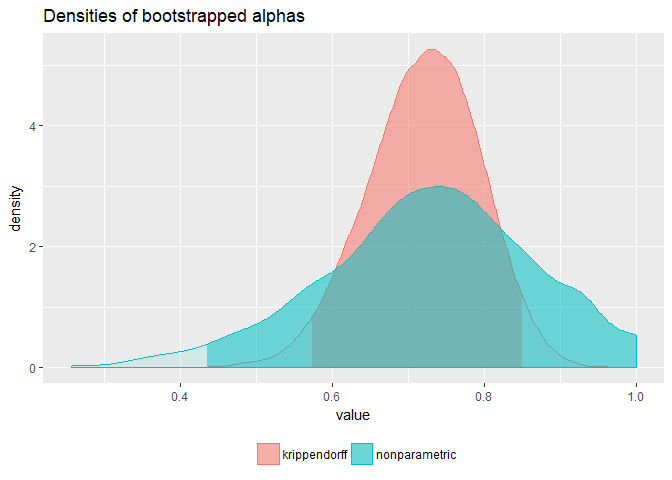
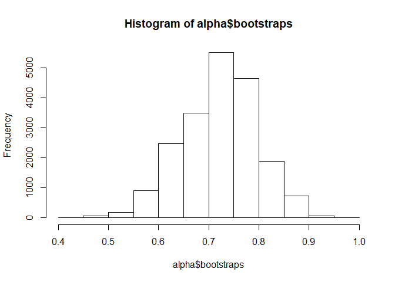
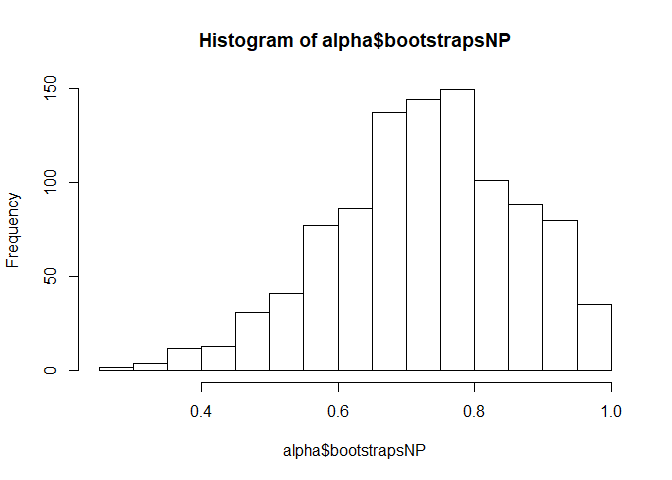

<!-- README.md is generated from README.Rmd. Please edit that file -->
icr [](https://cran.r-project.org/package=icr) [](https://travis-ci.org/staudtlex/icr)
==========================================================================================================================================================================================================================

icr provides functions to compute and plot Krippendorff's inter-coder reliability coefficient *α* and bootstrapped uncertainty estimates. The bootstrap routines are set up to make use of parallel threads via [OpenMP](https://en.wikipedia.org/wiki/OpenMP).

Installation
------------

``` r
# Install the released version from CRAN:
install.packages("icr")

# Or install the development version from GitHub:
# install.packages("devtools")
devtools::install_github("staudtlex/icr")
```

Enable parallel bootstraps on macOS (if required; otherwise ignore this section)
--------------------------------------------------------------------------------

The parallel bootstrap capability of icr depends on compiler support for OpenMP, which the *Clang* compiler shipped by default with macOS does not support. To circumvent this issue, simply install the *GNU Compiler Collection (GCC)* (or an updated version of Clang) using [Homebrew](https://brew.sh/).

``` bash
brew install gcc
```

For R to build icr with GCC, you need to modify your `~/.R/Makevars` file. If `~/.R/Makevars` does not exist, you need to create it first. Assuming that you installed the latest GCC with Homebrew, put these lines in your `Makevars` (note that all future R-packages installed and built from source will use GCC as default compiler).

``` bash
CC=gcc-7
CXX=g++-7
CXX11=g++-7
```

Finally, install icr from source with the additional argument `--configure-vars="CXX=g++-7"` (this enables `R CMD install` to set the appropriate OpenMP-flags).

``` r
# Install source package from CRAN
install.packages("icr", type = "source" configure.vars = "CXX=g++-7")

# Alternatively, install the latest version from GitHub
devtools::install_github("staudtlex/icr", args = "--configure-vars='CXX=g++-7'")
```

Usage
-----

Load the library and Krippendorff's example data:

``` r
library(icr)
data(codings)

codings
#>      [,1] [,2] [,3] [,4] [,5] [,6] [,7] [,8] [,9] [,10] [,11] [,12]
#> [1,]    1    2    3    3    2    1    4    1    2    NA    NA    NA
#> [2,]    1    2    3    3    2    2    4    1    2     5    NA    NA
#> [3,]   NA    3    3    3    2    3    4    2    2     5     1     3
#> [4,]    1    2    3    3    2    4    4    1    2     5     1    NA
```

Compute the reliability coefficient *α* for nominal-level data.

``` r
krippalpha(codings, metric = "nominal")
#> 
#>  Krippendorff's alpha 
#> 
#>  Alpha coders units   level
#>  0.743      4    12 nominal
#> 
#>  Bootstrapped alpha
#>  Alpha Std. Error 2.5 % 97.5 % Boot. technique Bootstraps
#>     NA         NA    NA     NA    Krippendorff         NA
#>     NA         NA    NA     NA   nonparametric         NA
#> 
#>  P(alpha > alpha_min):
#>  alpha_min krippendorff nonparametric
#>       0.90           NA            NA
#>       0.80           NA            NA
#>       0.70           NA            NA
#>       0.67           NA            NA
#>       0.60           NA            NA
#>       0.50           NA            NA
```

To check whether how uncertain *α* may be, or whether it actually differs from various minimal reliability thresholds, bootstrap *α*. For reproducibility, do not forget to set the seed.

``` r
set.seed(100, kind = "L'Ecuyer-CMRG")
.Random.seed[2:7]
#> [1]   369653371 -1991893120 -1673479807   583080270 -1137165961  -848818356
```

Given that bootstrapping may take quite some time for large amounts of reliability data, increase the number of cores across which `krippalpha` may distribute the computations (note that if your version does not support the use of multiple cores, `krippalpha` will reset `cores` to 1).

``` r
alpha <- krippalpha(codings, metric = "nominal", bootstrap = TRUE, bootnp = TRUE, cores = 2)
print(alpha)
#> 
#>  Krippendorff's alpha 
#> 
#>  Alpha coders units   level
#>  0.743      4    12 nominal
#> 
#>  Bootstrapped alpha
#>  Alpha Std. Error 2.5 % 97.5 % Boot. technique Bootstraps
#>  0.721      0.074 0.572   0.85    Krippendorff      20000
#>  0.727      0.139 0.435   1.00   nonparametric       1000
#> 
#>  P(alpha > alpha_min):
#>  alpha_min krippendorff nonparametric
#>       0.90        0.003         0.115
#>       0.80        0.135         0.304
#>       0.70        0.644         0.598
#>       0.67        0.740         0.687
#>       0.60        0.942         0.820
#>       0.50        0.997         0.938
```

Compare the distributions of bootstrapped *α*. The distributions resulting from Krippendorff's algorithm and the non-parametric bootstrap (resampling the coding units) look quite different. For a quick look, just use `plot()`.

``` r
plot(alpha)
```



The vectors of bootstrapped *α* may also be accessed and plotted directly as follows:

``` r
hist(alpha$bootstraps) # Krippendorff-bootstrap
```



``` r
hist(alpha$bootstrapsNP) # nonparametric bootstrap
```



License
-------

GPL (&gt;= 2)
